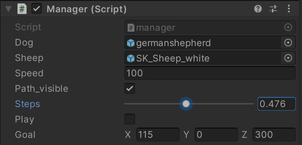
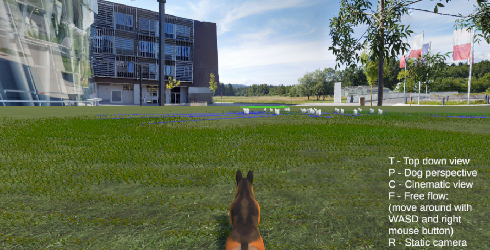
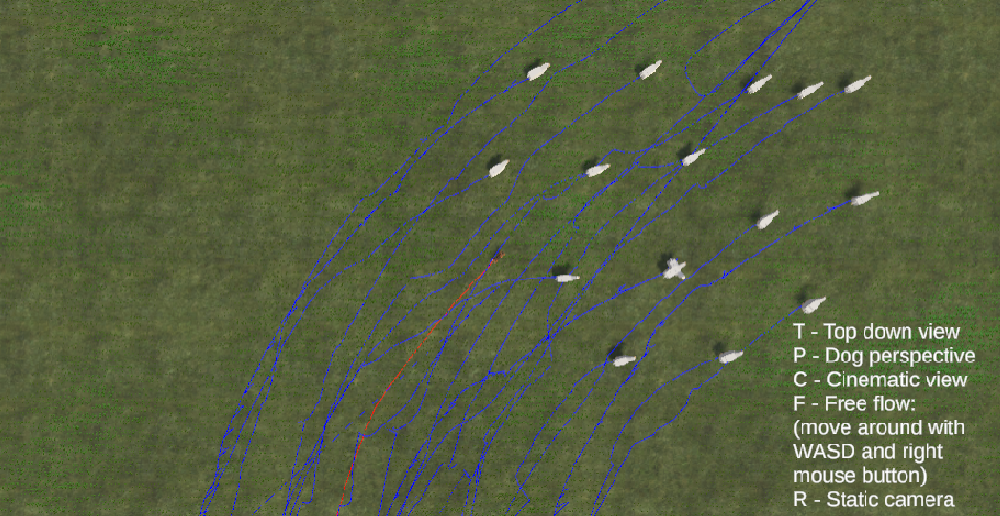
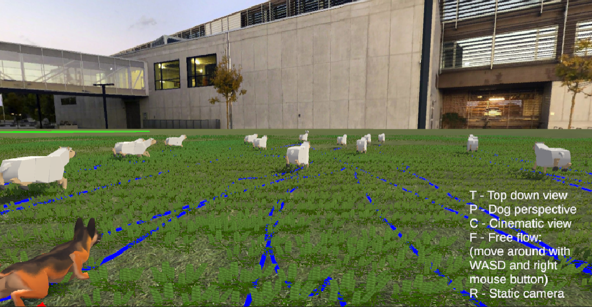
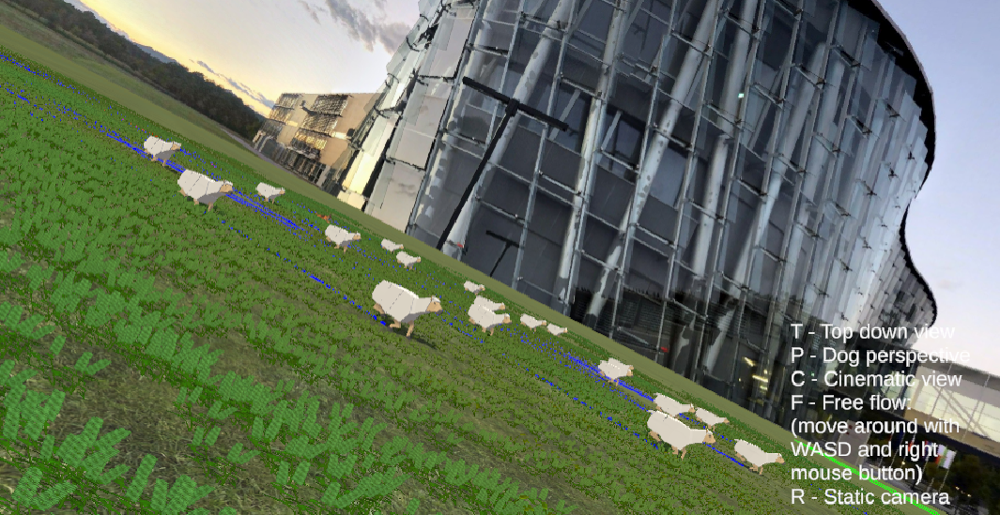
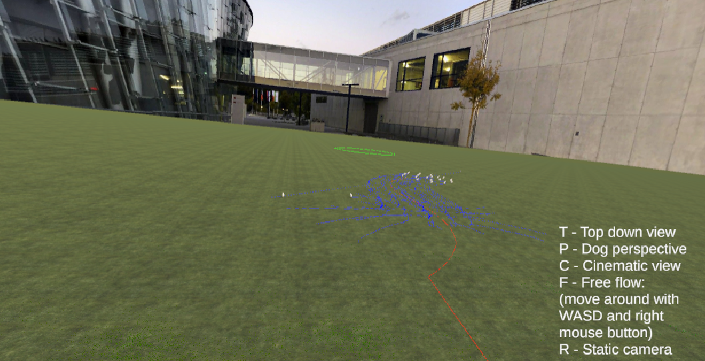

# Introduction
TODO Ivi

# The paper
TODO Ivi
say something about the paper

# related work 
Done in last report

# The Algorithm
TODO Ivi
explain how the algorithm works and how everything is computed.
Maybe show some difficulties (weird paper notation and so on).

# Implementation
In this section, the Python implementation of the simulation is described in detail.

## Object-Oriented Approach
To simulate the behavior of the sheep and the dog, we employed an object-oriented programming approach
using plain Python. The only external libraries used were NumPy for numerical operations and Matplotlib
for visualization.

The core of the simulation is encapsulated within the Simulation class.
All fixed parameters, such as the number of sheep, the destination position (sheepfold),
the attraction radius, and the safety radius, are defined as class variables.
Additionally, the current positions of the sheep and the dog are stored as NumPy arrays,
ensuring efficient computation and manipulation.

## Simulation Process
The simulation operates as a series of discrete steps. At the beginning of each step,
the algorithm checks if convergence has been achieved—specifically, whether all sheep are within
the destination circle. If this condition is met, the algorithm terminates. Otherwise,
the simulation proceeds to calculate the updated positions of the dog and sheep.

1. Dog Movement

    A velocity vector is computed for the dog. This velocity is scaled by a sampling period T and added to the previous position of the dog to determine its new position.

2. Sheep Movement

    Each sheep’s velocity is calculated based on its current state. This velocity is then transformed using a rotation matrix (parameterized by an angle θθ) and added to its previous position.

After updating the positions, the step counter is incremented, and the old positions are stored.
This historical data is essential for generating visualizations, as it provides the trajectory
of both the sheep and the dog.

A simple visualization was implemented during development as a Python scatter plot.
In this plot, the sheep and dog are represented by points of different colors,
providing an intuitive view of their movements. (TODO: Add an image of this development visualization.)

The final visualization, which offers a more polished and informative representation,
is discussed in detail in the (TODO: Reference the "Visualization" section here).

# Problems with the Paper
Our attempt to replicate the study described in the paper "Sheepdog Driven Algorithm for Sheep Herd Transport" was met with significant challenges, primarily due to the paper's poor quality of presentation and lack of necessary detail. The paper suffers from a significant lack of clarity, as it introduces a multitude of mathematical symbols and concepts without adequate definitions or explanations. Numerous terms are vaguely defined or left entirely undefined, forcing us to conduct extensive independent research and make educated guesses, often without confidence in our assumptions. This was particularly problematic as our background in the relevant physics and mathematical modeling fields is limited. 

For instance, the paper introduces terms like $S_r(p_d - x)$ and $S_l(p_d - x)$ in Equation (24) to describe directional sets, but it never defines what these terms represent, nor does it provide any guidance on their practical computation. Similarly, the authors define the term $D_{qd}(k)$, the direction from the sheepdog to the sheepfold, but this variable is never used in any subsequent equations or pseudocode, leaving its purpose unclear. The presence of such poorly explained variables creates significant ambiguity, particularly for readers outside the field of study.

Even terms that are defined mathematically, such as $o(x) = \frac{x}{\|x\|}$, which represents a unit vector, are presented in a way that assumes prior familiarity with their use in this specific context. This nonstandard notation and its interplay with other terms, such as the vectors $p_{qi}(k)$ and $p_{di}(k)$, are not sufficiently clarified. The function $P_s(k)$, introduced as the ``sheep herd polygon,'' is described mathematically as a convex combination of sheep positions, but the paper fails to explain how this construct is used in the algorithm. Despite its apparent importance, it does not appear in any subsequent equations or decision-making processes, raising the question of why it was included at all.

The challenges we faced were compounded by the lack of response from the authors when we attempted to contact them for clarification. Without guidance, we had to rely on trial and error, independent research, and assumptions to fill in the gaps left by the paper. After implementing the algorithm exactly as described, we observed behavior contrary to the intended goal: the sheepdog initially moved away from the sheep instead of herding them toward the destination. After extensive debugging, we discovered that reversing the sign in the $o(q(k) - D_l(k))$ function on lines 20 and 22 of the pseudocode resolved this issue. However, this adjustment had no clear justification within the framework of the paper, leading us to suspect that either an error exists in the pseudocode or that the algorithm relies on unstated assumptions. Despite spending countless hours verifying every function and re-reading the theoretical background, we could not resolve these contradictions or make the algorithm work as described.

# Visualization
The visualization was done in 3D with Unity version 2021.3.20f1.
As an input it receives the coordinates from the Python-Program as .jsons for each single entity.

## Manager

The scene includes a Manager which creates all the entities dynamically based on the generated .json files. This includes coordinates, the amount of sheeps, dogs and their starting and destination points. The Manager it is the core object of the visualization where the "player" can adapt several parameters during runtime like speed or if the simulation should draw the paths of each entity. It holds the destination/goal (visualized by a green circle) as well as the graphical representatives for the dog and the sheeps, which the user can exchange easily if wished. Our used ones are https://assetstore.unity.com/packages/3d/characters/animals/mammals/3d-stylized-animated-dogs-kit-284699 for the shepherd and from https://assetstore.unity.com/packages/3d/characters/animals/animated-goat-and-sheep-3d-low-poly-free-251910 we used the sheep model. Furthermore it is possible within in the Manager to go through the simulation-steps manually instead of play it automatically.

*Inspector of Manager*
## Environment
Since our simulation does not support hills or other uneven terrain, we need to stuck to a flat terrain. However we tried to make it as beautiful as possible with some textures and the Painting-Details build in feature of Unity. For gras and textures, we took https://assetstore.unity.com/packages/2d/textures-materials/nature/grass-flowers-pack-free-138810. In addition to this we wanted to have something more special and we decided to include a Skybox as background which shows the FRI of Ljubljana.
First we tried to do it with a panorama-photo which was taken by ourselves, but the result did not look as good as we were hoping for.
Funny enough, a dog in real life joined us randomly during this procedure.

*Us trying to use a selfmade panorama as background for Unity*

In the end we used a 360° photo from the FRI website https://www.fri.uni-lj.si/sl/virtualni-sprehod / Google Maps and then wrapped it to create a 360° skybox. This method gave us quite well looking results:

*Environment from Dog Perspective*
## Camera options
We have implemented 5 differernt camera modes including a smooth transition when switchting between them:
### 1. Dog Perspective

This can be activated by pressing P on the keyboard. The user gets a third person view from the dog.
(See image from previous section!)
### 2. Top down view
This can be activated by pressing T on the keyboard. The user gets a top down view on the dog.

*Top down view*
### 3. Cinematic View
This can be activated by pressing C on the keyboard. The user gets a very similar perspective compared to the Dog Perspective. However we tried to make it more cinematic to move the camera around a little bit, like showing everything from the side.

*Cinematic View*
### 4. Free Flow
This can be activated by pressing F on the keyboard. The user can now move the camera around freely be pressing WASD and rotate the camera by holding the right mouse button.

*Free flow*
### 5. Static Camera
This can be activated by pressing R on the keyboard. This is just a static camera position for the whole scene.

*Static camera*
## Technical implementation
After the manager has created all the entities, each of them gets assigned an array of coordinates from the .json file. In order to draw the paths, we used a linerenderer which is assigned by the Manager to each entity and draws the path one entity has gone yet. The simulation moves all the entities at the same speed from one coordinate to the next one with interpolating between the respective two coordinates. We needed to be aware of overflows and especially transitions between the coordinates which was quite challenging, because we wanted to provide as much freedom as possible for the user (he should be able to adapt any parameter during runtime and even play the simultion in reverse). After updating the position of each entity, we also updated their rotation such that they look into the direction where they move. This was implemented via a lerp function to get an even more realistic impression of the scene. All of this has been implemented by hand in order to have full controll and do not fall into a trap with Unity's build in execution order logic.

# Conclusion
TODO Ivi